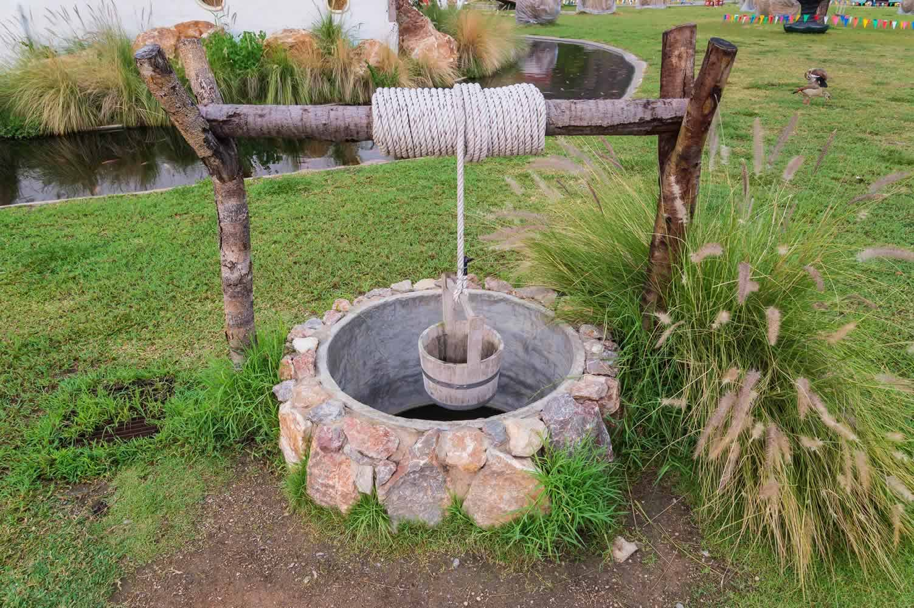
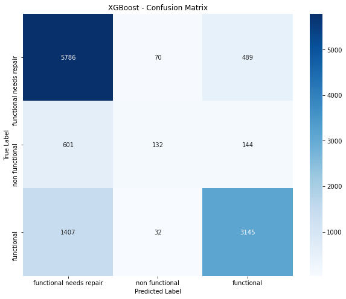

##  PREDICTING THE FUNCTIONALITY OF WATER WELLS IN TANZANIAP

## Project Overview

This project aims to develop a classifier that predicts the condition of water wells in Tanzania based on various factors such as the type of pump, installation date, and other relevant information. The target audience for this classifier could be an NGO focused on identifying wells in need of repair or the Government of Tanzania seeking insights to inform future well construction decisions.

## Problem Statement

Access to safe and consistent drinking water is a major challenge in Tanzania, especially in rural regions with minimal infrastructure. To solve this issue, the Tanzanian government has made investments in the building of water wells in collaboration with a number of non-governmental organizations. However, the sustainability and functionality of these wells remain uncertain, with many of them falling into disrepair or becoming non-functional over time.

### Objectives

Main objective 
 1. To develop a machine learning classifier(using  decision trees, random forest and XGBoost)that predicts the condition of water wells in Tanzania.

Specific objectives
1. Prepare and analyse data for modeling
2. Develop predictive Model
3. Provide actionable insights and recommendations based on the findings of the model

## Data Understanding

The data is sourced from Taarifa and the Tanzanian Ministry of Water. Data utilized can be found here: https://www.drivendata.org/competitions/7/pump-it-up-data-mining-the-water-table/data/

For the purposes of our evaluation, we are utilizing the Training Set Labels and Training Set Values, which include data from 59,400 pumps. 
We will then use the Test set values to test our models.

## Modelling and Evaluation

I tested different models and based on the accuracy score I settled on XGBoost classifier. The other models include decision trees, random forest and logistic regression.

I was also able to incorporate stacking and pipelines in my study.

The classification metrics I was using were:

    - Precision
    - Accuracy score
    - Recall 
    - F1-score
I also used a confusion matrix to display my results. 

## Recommendations

From the study I have done, I would recommend using XGBoost model to make predictions on Tanzanian water wells. The model had a testing accuracy of about 76%. This will allow the the government and other stakeholders like the NGO's to optimize their resource allocation by sending maintenance teams to pumps that truly need repairs or are non-functional. 

This will help ensure continuity of these water wells running. It wil also help them in coming up with better methods to build water wells that can last for long.

## Limitations

Some limitations that I ran into include:

1. Class Imbalance: there are very few data points with Function Needs Repair.
2. Time to run models: running multiple GridSearchCV fits can take hours if not days.
3. Lack of domain expertise: I am not well versed in what factors for water pumps contribute to its ability to function or not.

## Next Steps

1. Improve class imbalance by using techniques such as oversampling or undersampling to balance the class distribution in the training data. 
2. Use Hyperparameter tuning. Using Grid search or random search can help improve the model's ability to generalize and make accurate predictions on unseen data.
3. Incorporating Cross-validation. This will help identify whether the model's performance is consistent across different subsets of the data and reduce the risk of overfitting.
4. Gain a deeper understanding of the domain and the factors that influence the functionality of waterpoints.

